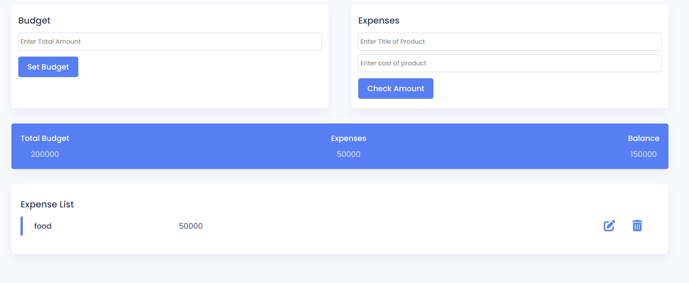

# Budget App

A simple web-based Budget Application that helps users manage their budget by tracking income, expenses, and balance. This app is built using HTML, CSS, and JavaScript.

## Features

- **Set Budget**: Users can set their total budget amount.
- **Add Expenses**: Users can add expenses by entering a product title and cost.
- **Expense List**: All expenses are displayed in a list with the name and cost.
- **Budget Summary**: Real-time display of total budget, total expenses, and remaining balance.

## Technologies Used

- **HTML**: Structure of the application.
- **CSS**: Styling for a responsive and user-friendly layout.
- **JavaScript**: Logic for managing the budget, adding expenses, and calculating totals.

### Customization

- **Fonts**: The app uses the [Poppins font](https://fonts.google.com/specimen/Poppins) from Google Fonts.
- **Icons**: Icons are sourced from [Font Awesome](https://fontawesome.com/).

## Getting Started

### Prerequisites

- A web browser (Chrome, Firefox, Edge, etc.)

### Installation

- Clone the repository or download the source files.

```bash
 https://github.com/katherinekhine/budget-app.git
```

## Usage

1. Set Budget:

   - Enter your total budget in the input field and click "Set Budget".
   - The budget amount will display under "Total Budget".

2. Add Expenses:

   - Enter the product title and the cost, then click "Check Amount".
   - The expense will appear in the Expense List, and the Total Expenses and Balance will update.

3. View Budget Summary:

   - The app shows your Total Budget, Total Expenses, and Balance in real-time.

## Screenshots


